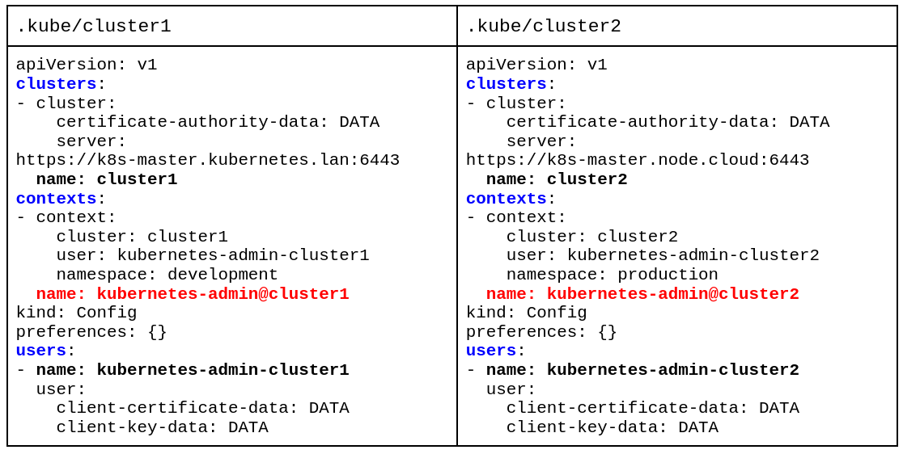

# Configure Access to Multiple Clusters

This page shows how to configure access to multiple clusters by using 
configuration files. After your clusters, users, and contexts are defined 
in one or more configuration files, you can quickly switch between clusters 
by using the ```kubectl config use-context``` command.

In this example we are going to setup one file per cluster following the
picture example:



Each KUBECONFIG manages CLUSTERS, USERS and CONTEXTS. The CONTEXTS establish 
relationships among clusters, users and namespaces. When CONTEXTS are changed, 
a cluster, a user and a namespace are established (if the namespace is not 
established, the default is established).

In this example we have two KUBECONFIG files, where we only have defined a 
CLUSTER and a USER and a NAMESPACE by default. We have also defined two 
CONTEXTS to be able to switch between them.

* The context with name: **kubernetes-admin@cluster1** refers to CLUSTER: **cluster1**
and USER: **kubernetes-admin-cluster1**

* The context with name: **kubernetes-admin@cluster2** refers to CLUSTER: **cluster2** 
and USER: **kubernetes-admin-cluster2**

The way to mix them in memory is with the command:

```
export KUBECONFIG=$HOME/.kube/cluster1:$HOME/.kube/cluster2
```

## Example session

```
$ export KUBECONFIG=$HOME/.kube/vagrant:$HOME/.kube/nebula
```

```
$ k config get-contexts 
CURRENT   NAME                       CLUSTER   AUTHINFO                   NAMESPACE
          kubernetes-admin@nebula    nebula    kubernetes-admin-nebula    
*         kubernetes-admin@vagrant   vagrant   kubernetes-admin-vagrant 
```

```
$ k config use-context kubernetes-admin@vagrant 
Switched to context "kubernetes-admin@vagrant".
```

```
$ k get nodes -o wide
NAME                          STATUS   ROLES           AGE   VERSION   INTERNAL-IP   EXTERNAL-IP   OS-IMAGE                KERNEL-VERSION           CONTAINER-RUNTIME
k8s-master.kubernetes.lan     Ready    control-plane   43m   v1.24.6   10.0.0.3      <none>        CentOS Linux 7 (Core)   3.10.0-1127.el7.x86_64   cri-o://1.24.3
k8s-worker01.kubernetes.lan   Ready    <none>          35m   v1.24.6   10.0.0.4      <none>        CentOS Linux 7 (Core)   3.10.0-1127.el7.x86_64   cri-o://1.24.3
k8s-worker02.kubernetes.lan   Ready    <none>          35m   v1.24.6   10.0.0.5      <none>        CentOS Linux 7 (Core)   3.10.0-1127.el7.x86_64   cri-o://1.24.3
k8s-worker03.kubernetes.lan   Ready    <none>          35m   v1.24.6   10.0.0.6      <none>        CentOS Linux 7 (Core)   3.10.0-1127.el7.x86_64   cri-o://1.24.3
k8s-worker04.kubernetes.lan   Ready    <none>          35m   v1.24.6   10.0.0.7      <none>        CentOS Linux 7 (Core)   3.10.0-1127.el7.x86_64   cri-o://1.24.3
```

## Example setup for .bashrc

```
# PATH for kubectl plugins
PATH="${KREW_ROOT:-$HOME/.krew}/bin:$PATH"
export PATH

# Kubernetes k alias with autocompletion
source <(kubectl completion bash)
alias k=kubectl
complete -F __start_kubectl k 
```

